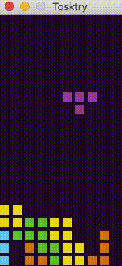

#Tosktry

Tosktry is a minimalist clone of Tetris with pygame.

No highscores / menu / next piece / nothing else, just the game.

Runs with `tosktry.py`. Keys:

* `left cursor`: Move left
* `right cursor`: Move right
* `up cursor`: Rotate 90 degrees
* `down cursor`: Fall faster

The script accepts a `-b` argument to enable a bot to create random key events. It's been useful to find bugs that crashed the game.
